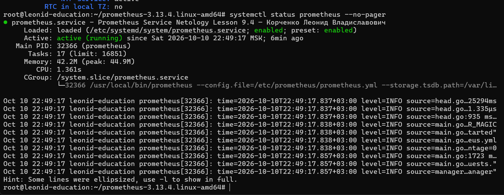
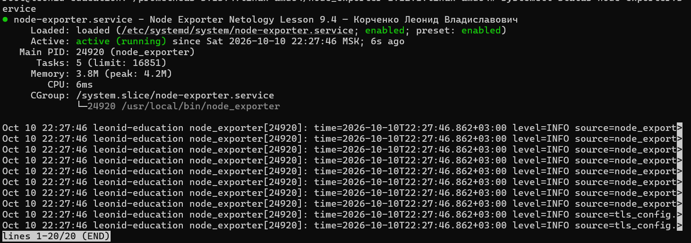
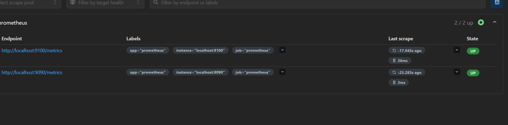
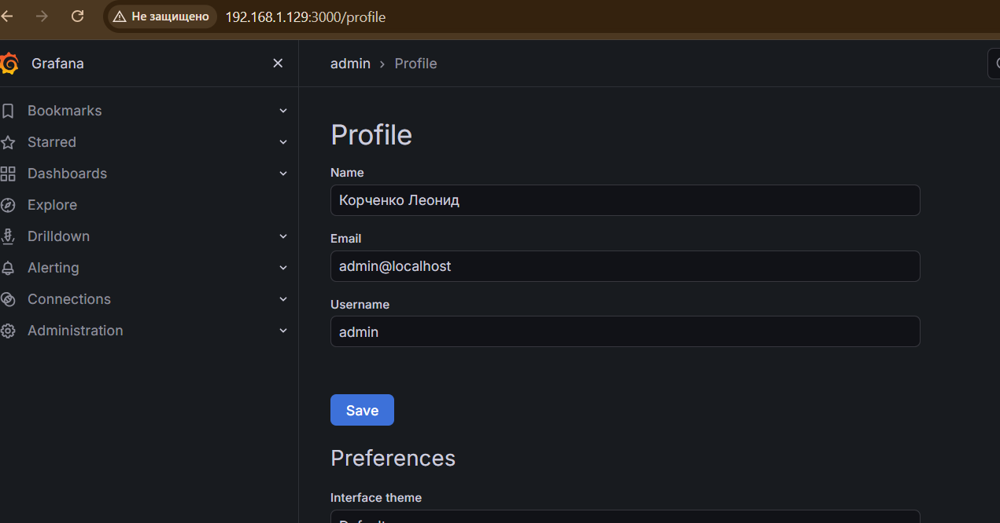
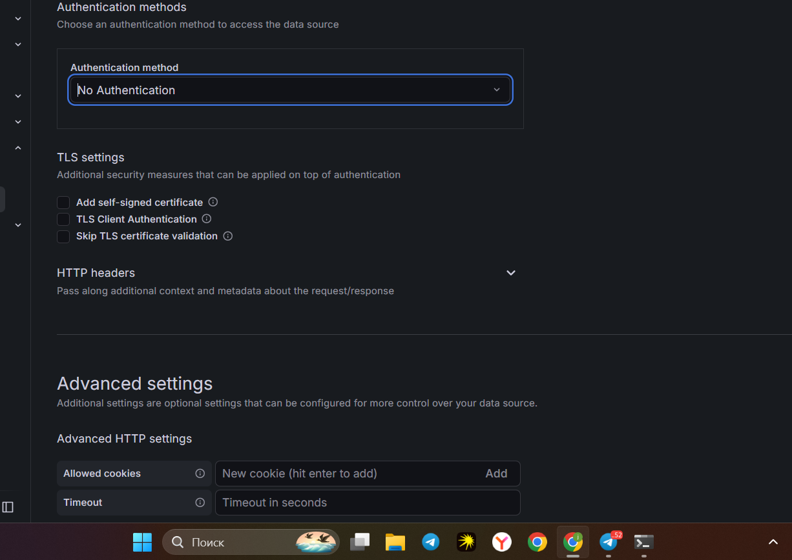
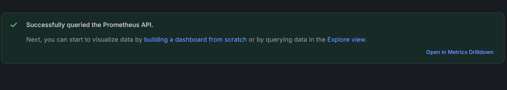
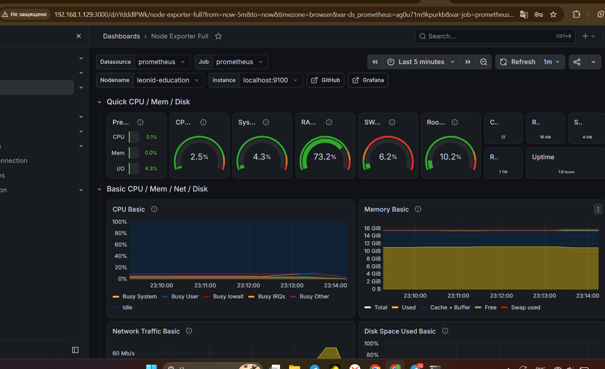
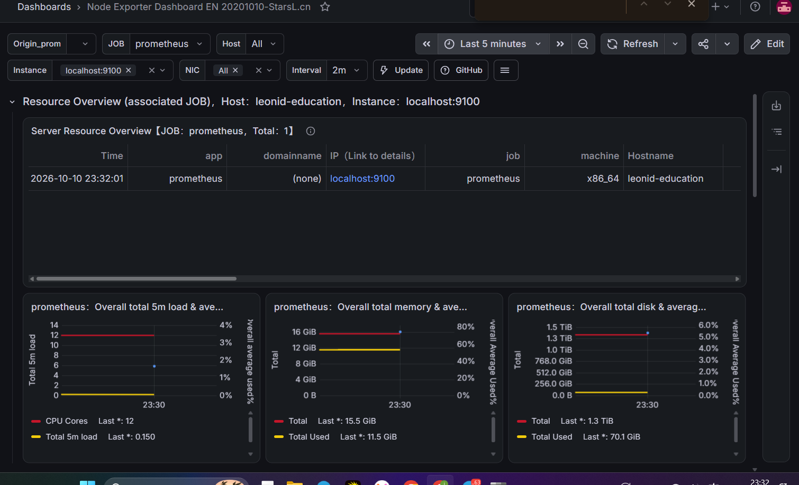

# Домашнее задание к занятию «Система мониторинга Prometheus» — Корченко Леонид Владиславович

Стенд: ВМ Ubuntu `leonid-education` (192.168.1.129), Prometheus 3.13.4, Node Exporter 1.12.1, Grafana OSS.

---

### Задание 1

Установка Prometheus.

1. Создан системный пользователь `prometheus` без домашнего каталога и без входа в систему.
2. Скачан архив Prometheus с [GitHub Releases](https://github.com/prometheus/prometheus/releases), файлы разложены по FHS:
   программы — в `/usr/local/bin`, конфиг — в `/etc/prometheus`, база — в `/var/lib/prometheus`.
3. Создан сервис `prometheus.service`.
4. Проверены запуск, остановка, перезапуск и статус через `systemctl`.

> В Prometheus 3.x нет каталогов `consoles` и `console_libraries`, поэтому они не копируются, а параметры `--web.console.*` в сервисе не указываются.

```bash
useradd --no-create-home --shell /bin/false prometheus

wget https://github.com/prometheus/prometheus/releases/download/v3.13.4/prometheus-3.13.4.linux-amd64.tar.gz
tar xvfz prometheus-3.13.4.linux-amd64.tar.gz
cd prometheus-3.13.4.linux-amd64

mkdir /etc/prometheus /var/lib/prometheus
cp prometheus promtool /usr/local/bin/
cp prometheus.yml /etc/prometheus/
chown -R prometheus:prometheus /etc/prometheus /var/lib/prometheus
chown prometheus:prometheus /usr/local/bin/prometheus /usr/local/bin/promtool
```

`/etc/systemd/system/prometheus.service`:

```ini
[Unit]
Description=Prometheus Service Netology Lesson 9.4 — Корченко Леонид Владиславович
After=network.target

[Service]
User=prometheus
Group=prometheus
Type=simple
ExecStart=/usr/local/bin/prometheus \
  --config.file=/etc/prometheus/prometheus.yml \
  --storage.tsdb.path=/var/lib/prometheus/
ExecReload=/bin/kill -HUP $MAINPID
Restart=on-failure

[Install]
WantedBy=multi-user.target
```

```bash
systemctl daemon-reload
systemctl enable prometheus
systemctl start prometheus
systemctl stop prometheus
systemctl restart prometheus
systemctl status prometheus --no-pager
```



---

### Задание 2

Установка Node Exporter.

1. Скачан архив Node Exporter с [GitHub Releases](https://github.com/prometheus/node_exporter/releases), сборка `linux-amd64`.
2. В архиве только исполняемый файл, без конфига и без данных, поэтому он копируется в `/usr/local/bin`. Дополнительные права не нужны: Node Exporter ничего не пишет на диск.
3. Создан сервис `node-exporter.service`, запускается от пользователя `prometheus`.
4. Проверены запуск, остановка, перезапуск и статус через `systemctl`.

```bash
wget https://github.com/prometheus/node_exporter/releases/download/v1.12.1/node_exporter-1.12.1.linux-amd64.tar.gz
tar xvfz node_exporter-1.12.1.linux-amd64.tar.gz
cd node_exporter-1.12.1.linux-amd64
cp node_exporter /usr/local/bin/
```

`/etc/systemd/system/node-exporter.service`:

```ini
[Unit]
Description=Node Exporter Netology Lesson 9.4 — Корченко Леонид Владиславович
After=network.target

[Service]
User=prometheus
Group=prometheus
Type=simple
ExecStart=/usr/local/bin/node_exporter
Restart=on-failure

[Install]
WantedBy=multi-user.target
```

```bash
systemctl daemon-reload
systemctl enable node-exporter
systemctl start node-exporter
systemctl stop node-exporter
systemctl restart node-exporter
systemctl status node-exporter --no-pager
```



---

### Задание 3

Подключение Node Exporter к Prometheus.

1. В `/etc/prometheus/prometheus.yml` в массив `targets` добавлен Node Exporter (`localhost:9100`).
2. Конфиг проверен утилитой `promtool`.
3. Prometheus перезапущен, оба эндпоинта в состоянии UP.

```yaml
scrape_configs:
  - job_name: "prometheus"
    static_configs:
      - targets: ["localhost:9090", "localhost:9100"]
```

```bash
promtool check config /etc/prometheus/prometheus.yml
systemctl restart prometheus
systemctl status prometheus --no-pager
```

Status → Target health (2 / 2 up):



---

### Задание 4*

Установка Grafana из официального apt-репозитория.

```bash
apt-get install -y apt-transport-https software-properties-common wget
mkdir -p /etc/apt/keyrings/
wget -q -O - https://apt.grafana.com/gpg.key | gpg --dearmor | tee /etc/apt/keyrings/grafana.gpg > /dev/null
echo "deb [signed-by=/etc/apt/keyrings/grafana.gpg] https://apt.grafana.com stable main" | tee /etc/apt/sources.list.d/grafana.list
apt-get update
apt-get install -y grafana

systemctl daemon-reload
systemctl enable --now grafana-server
systemctl status grafana-server --no-pager
```

Веб-интерфейс: `http://192.168.1.129:3000`. В профиле пользователя `admin` указано ФИО.



---

### Задание 5*

Интеграция Grafana и Prometheus.

1. Connections → Data sources → Add data source → Prometheus, URL `http://localhost:9090`.
2. Save & test: «Successfully queried the Prometheus API».
3. Импортирован дашборд **Node Exporter Full** (ID 1860) с источником данных Prometheus.







Дополнительно импортирован дашборд **Node Exporter Dashboard EN** (ID 11074):


